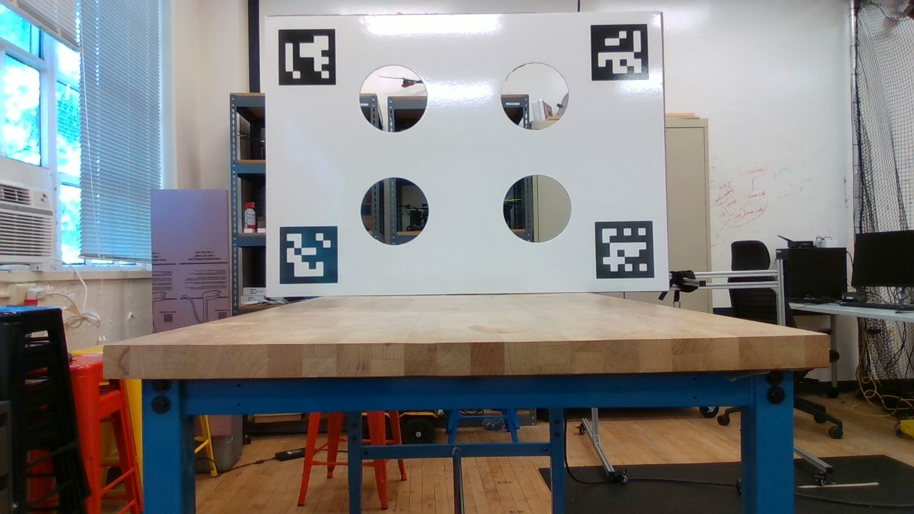
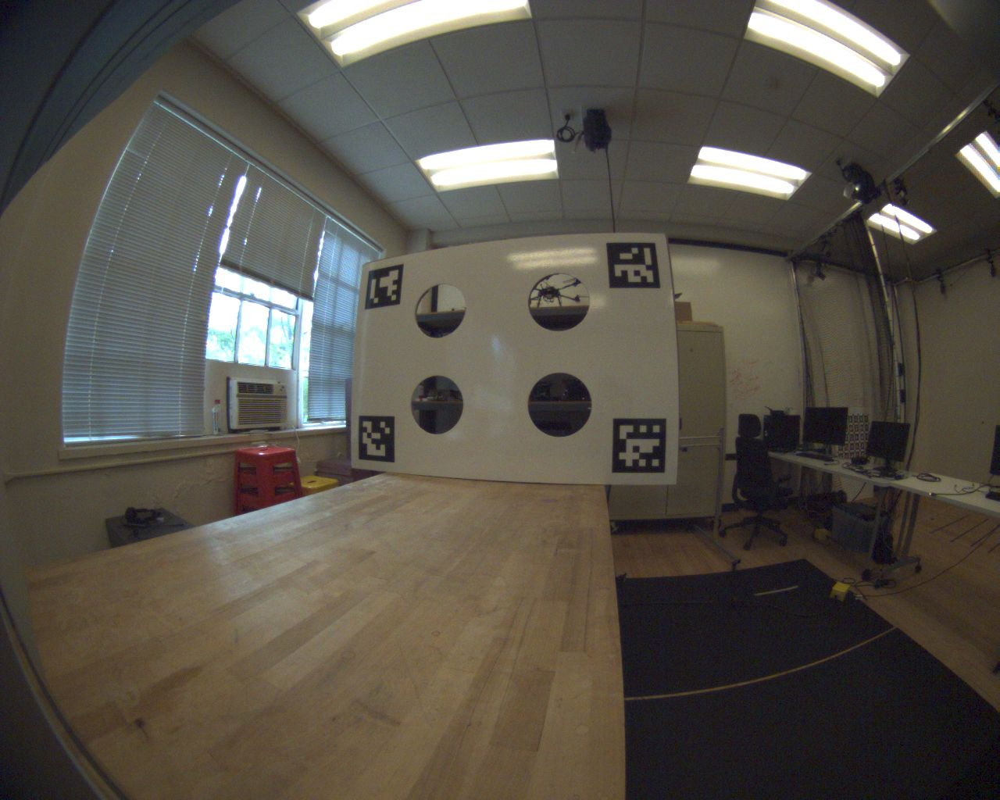
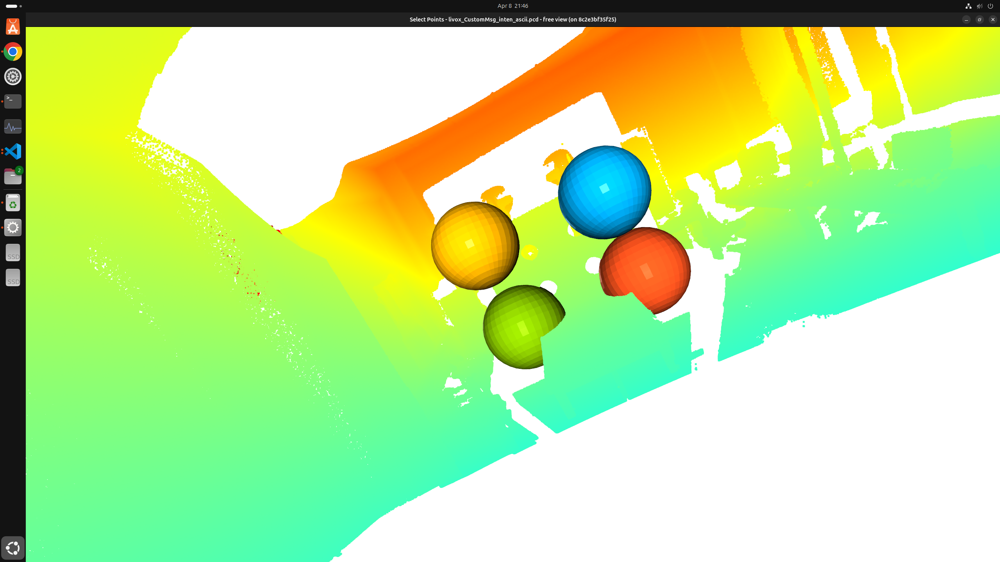
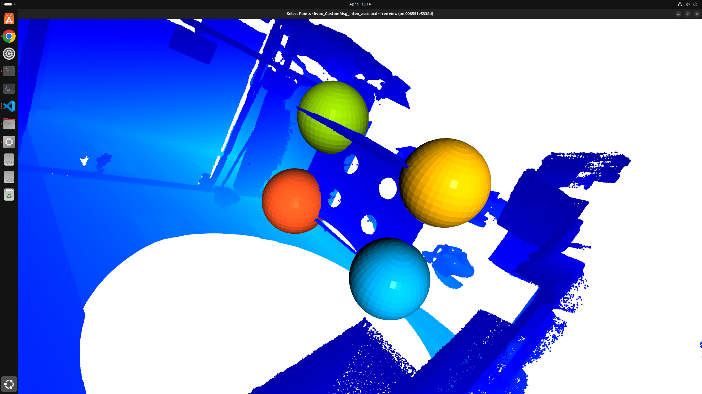
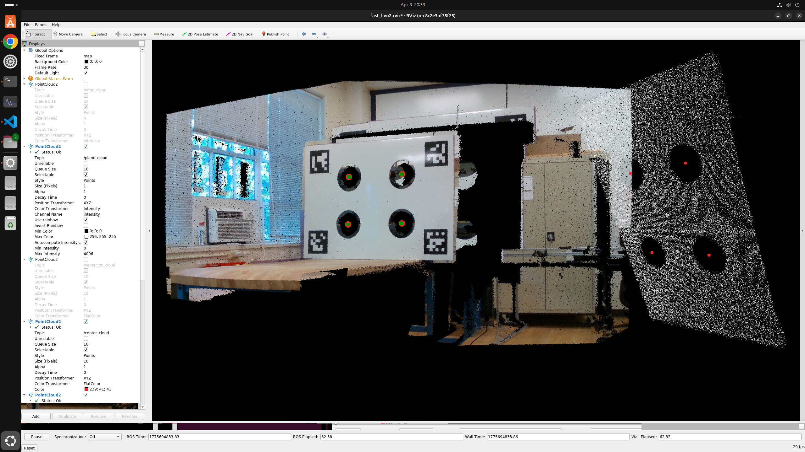
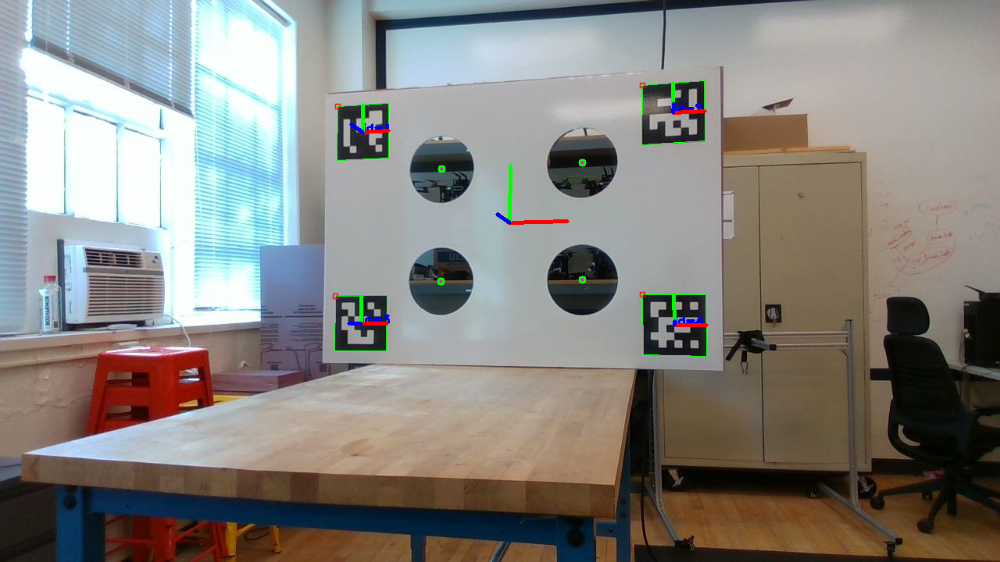
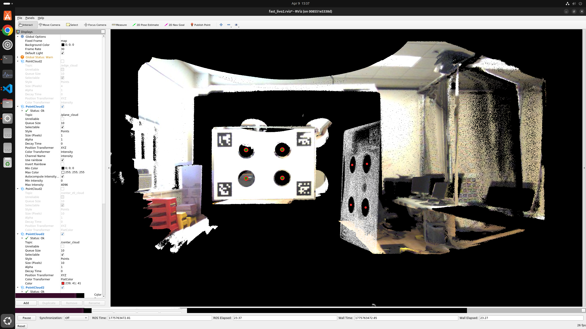
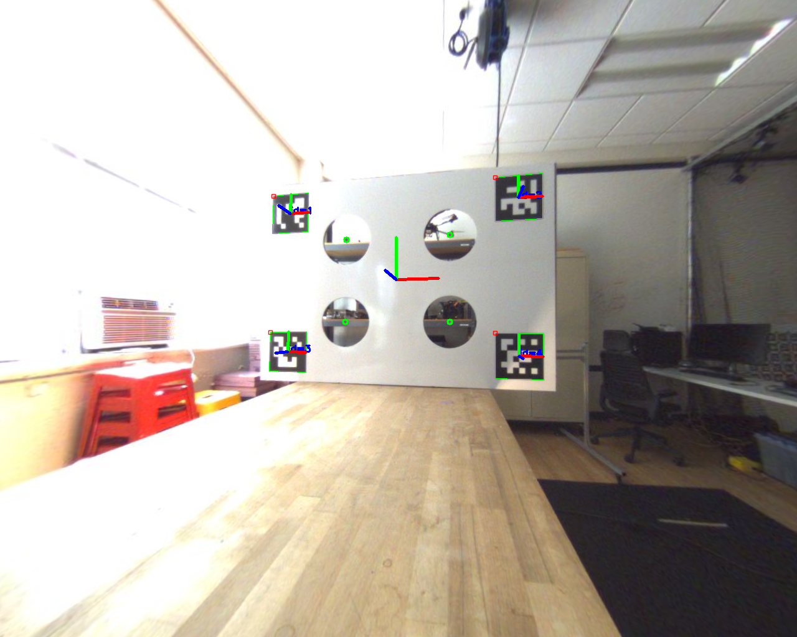

# My lidar-camera extrinsic calibration

## summary 

### 1. Docker image is built for FAST-Calib, Kalibr, RealSense driver, Livox MID-360 SDK and allan_variance_ros.
### 2. Equidistant (fisheye) camera distortion model is added for fisheye cameras.
### 3. saveimg_rosbag utility is added to extract images from a rosbag.
### 4. Multi-scene joint calibration now searches all C(N,3) scene combinations and picks the trio with the lowest RMSE.
### 5. Circle-fit inlier error threshold in lidar_detect.hpp is relaxed (0.025 → 0.035).


# Instructions

```bash
# ============================================================
# 1. Build the Docker image (on the host, from repo root)
# ============================================================
docker build -t kalibr_fastcalib_ros1_realsense:latest .
```
```bash
# ============================================================
# 2. Allow the container to open GUI windows on the host's X server
#    (run on the HOST, not inside the container)
# ============================================================
xhost +local:root
```
```bash
# ============================================================
# 3. Start the container with GPU + X11 forwarding
# ============================================================
sudo docker run -it \
    --env="DISPLAY=$DISPLAY" \
    --volume="/tmp/.X11-unix:/tmp/.X11-unix:rw" \
    --gpus all \
    kalibr_fastcalib_ros1_realsense:latest /bin/bash
# The ENTRYPOINT already sources /opt/ros/noetic/setup.bash and
# /catkin_ws/devel/setup.bash and drops you into /catkin_ws, so
# you do NOT need to run `source devel/setup.bash` manually.
```
```bash
# ============================================================
# 4. (Optional) Rebuild fast_calib if you edited C++ sources
#    The Dockerfile already builds everything, so skip this on
#    a fresh container.
# ============================================================
cd /catkin_ws
catkin build fast_calib
source devel/setup.bash
```
```bash
# ============================================================
# 5. Place your rosbags under calib_data/
#    Each scene = one rosbag containing the LiDAR topic and
#    the camera image topic. You need >= 3 scenes for the
#    multi-scene joint calibration step.
# ============================================================
# e.g. /catkin_ws/src/FAST-Calib/calib_data/DataBag_2026-04-09-10-20-34/data.bag
```
```bash
# ============================================================
# 6. Extract the first camera frame from each rosbag to an image.png
#    IMPORTANT: edit BAG_PATH and TOPIC at the top of the script
#    for EACH rosbag before running it.
#      - RealSense: TOPIC = '/camera/color/image_raw/compressed'
#      - Fisheye:   TOPIC = '/right_camera/image/compressed'
# ============================================================
cd /catkin_ws/src/FAST-Calib     # script uses ./calib_data/... (relative)
vim saveimg_rosbag.py            # edit BAG_PATH and TOPIC
python3 saveimg_rosbag.py
# Expected output:
#   Successfully saved compressed frame to ./calib_data/<BagName>/image.png
```
Examples of the distance-filter tool output:

* 📷 RealSense example:

  

* 🐟 Fisheye example:

  

```bash
# ============================================================
# 7. Pick a distance-filter box for each rosbag
#    Open3D window opens:
#      - Hold Shift + left-click to pick the 4 corners of the
#        calibration board (>= 4 points required).
#      - Press Q to close the window.
#    The tool writes <pcd_name>.txt into the output dir with
#    x_min/x_max/y_min/y_max/z_min/z_max values (board bbox
#    expanded by 0.2 m on every side).
# ============================================================
cd /catkin_ws
python3 src/FAST-Calib/scripts/distance_filter_tool.py \
    ./src/FAST-Calib/calib_data/DataBag_2026-04-09-10-20-34/data.bag \
    ./src/FAST-Calib/output
# Example Open3D log:
#   Processing: livox_CustomMsg_inten_ascii.pcd
#   [Open3D INFO] Picked point #10815894 (1.8,  0.69, 1.6)
#   [Open3D INFO] Picked point # 5603795 (1.8, -0.62, 1.6)
#   [Open3D INFO] Picked point # 1808882 (2.1, -0.66, 0.78)
#   [Open3D INFO] Picked point #  566301 (2.1,  0.62, 0.78)
# Then copy x_min/x_max/y_min/y_max/z_min/z_max from the generated
# .txt into the Distance filter block of qr_params.yaml (step 8).
```

Examples of the distance-filter tool output:

* 📷 RealSense example:

  

* 🐟 Fisheye example:

  

```bash
# ============================================================
# 8. Edit qr_params.yaml for THIS rosbag
#    Set per-sensor (edit once per sensor suite):
#      - fx, fy, cx, cy, k1, k2, p1, p2  (camera intrinsics)
#      - marker_size, delta_width/height_qr_center,
#        delta_width/height_circles, circle_radius
#      - lidar_topic (e.g. /livox/lidar, /ouster/points, /hesai/pandar)
#    Set per-rosbag (edit for every scene):
#      - bag_path, image_path
#      - x_min/x_max/y_min/y_max/z_min/z_max (from step 7)
#    To disable the distance filter, comment out the 6 x/y/z
#    lines and the code will use all points.
# ============================================================
vim src/FAST-Calib/config/qr_params.yaml
```

```bash
# ============================================================
# 9. Run single-scene calibration for this rosbag
#    RViz will open; the node writes its per-scene result into
#    the output_path configured in qr_params.yaml.
#    Repeat steps 6-9 for every rosbag (>= 3 total).
# ============================================================
roslaunch fast_calib calib.launch
```

Examples of the distance-filter tool output:

* 📷 RealSense example:

  
  

* 🐟 Fisheye example:

  
  

```bash
# ============================================================
# 10. After at least 3 scenes have been processed, run the
#     multi-scene joint calibration. It searches all C(N,3)
#     scene combinations and picks the trio with the lowest
#     RMSE (see summary item 4 above).
# ============================================================
roslaunch fast_calib multi_calib.launch
```

### Lidar-Camera Extrinsic Result

```bash
Example of RealSense D435 & Livox MID-360 lidar:

[Result] RMSE: 0.0036 m
[Result] Multi-scene calibration: extrinsic parameters T_cam_lidar = 
-0.001555 -0.999993  0.003546  0.027207
 0.443624 -0.003868 -0.896205 -0.224154
 0.896212  0.000179  0.443627 -0.026632
 0.000000  0.000000  0.000000  1.000000
```

* 📷 [Logs: RealSense D435 & Livox MID-360 lidar](output_geoscans1_realsense/log-geoscans1-realsense.txt)

```bash
Example of Fisheye Camera & Livox MID-360 lidar:

[Result] RMSE: 0.0032 m
[Result] Multi-scene calibration: extrinsic parameters T_cam_lidar = 
-0.007156 -0.999971  0.002528 -0.050784
 0.447482 -0.005463 -0.894276 -0.129908
 0.894264 -0.005269  0.447509 -0.006086
 0.000000  0.000000  0.000000  1.000000
```

* 🐟 [Logs: Fisheye Camera & Livox MID-360 lidar](output_geoscans1_rightfish/log-geoscans1_rightfisheye.txt)

----------------------------------------------------------------------------------------------------------

# FAST-Calib

## FAST-Calib: LiDAR-Camera Extrinsic Calibration in One Second

FAST-Calib is an efficient target-based extrinsic calibration tool for LiDAR-camera systems (eg., [FAST-LIVO2](https://github.com/hku-mars/FAST-LIVO2)). 

**Key highlights include:** 

1. Support solid-state and mechanical LiDAR.
2. No need for any initial extrinsic parameters.
3. Achieve highly accurate calibration results **in just one seconds**.

In short, it makes extrinsic calibration as simple as intrinsic calibration.

**Related paper:** 

[FAST-Calib: LiDAR-Camera Extrinsic Calibration in One Second](https://www.arxiv.org/pdf/2507.17210)

📬 For further assistance or inquiries, please feel free to contact Chunran Zheng at zhengcr@connect.hku.hk.

<p align="center">
  
  <font color=#a0a0a0 size=2>Left: Example of Mid360 LiDAR calibration. Right: Point cloud colored with the calibrated extrinsics.</font>
</p>

<p align="center">
  
  <font color=#a0a0a0 size=2>Circular hole extraction supports multiple LiDAR models.</font>
</p>

## 1. Prerequisites
PCL>=1.8, OpenCV>=4.0.

## 2. Run our examples
1. Prepare the static acquisition data in the `calib_data` folder (see [Single-scene Calibration Sample Data](https://drive.google.com/drive/folders/1W87Dx3MUuPhTpCLvaavWqNUJZV03yU6L?usp=drive_link) from Mid360, Avia and Ouster, and [Multi-scene Calibration Sample Data](https://drive.google.com/drive/folders/1g__plgFqp5tsk-TY7Ioh4RXru62AdLmr?usp=drive_link) from Avia):
- rosbag containing point cloud messages
- corresponding image

2. Run the single-scene calibration process:
```bash
roslaunch fast_calib calib.launch
```

3. After completing Step 2 for at least three different scenes, you can perform multi-scene joint calibration:
```bash
roslaunch fast_calib multi_calib.launch
```

## 3. Run on your own sensor suite
1. Customize the calibration target in the image below, with the CAD model available [here](https://pan.baidu.com/s/14Q2zmEfY6Z2O5Cq4wgVljQ?pwd=2hhn).
2. Collect data from three scenes, with placement illustrated below, and record them into the corresponding rosbags.
3. Provide the instrinsic matrix in `qr_params.yaml`.
4. Set distance filter in `qr_params.yaml` for board point cloud (extra points are acceptable).
5. Calibrate now!

💡 **Note:** You can run `scripts/distance_filter_tool.py` to quickly obtain suitable filter parameters.
<p align="center">
  
  <font color=#a0a0a0 size=2>Left: Actual calibration target | Right: Technical drawing with annotated dimensions.</font>
</p>
<p align="center">
  
  <font color=#a0a0a0 size=2>Placement of the calibration target for multi-scene data collection: (a) facing forward, (b) oriented to the right, (c) oriented to the left.</font>
</p>

## 4. Appendix
The calibration target design is based on the [velo2cam_calibration](https://github.com/beltransen/velo2cam_calibration).

For further details on the algorithm workflow, see [this document](https://github.com/xuankuzcr/FAST-Calib/blob/main/workflow.md).
## 5. Acknowledgments

Special thanks to [Jiaming Xu](https://github.com/Xujiaming1) for his support, [Haotian Li](https://github.com/luo-xue) for the equipment, and the [velo2cam_calibration](https://github.com/beltransen/velo2cam_calibration) algorithm.
